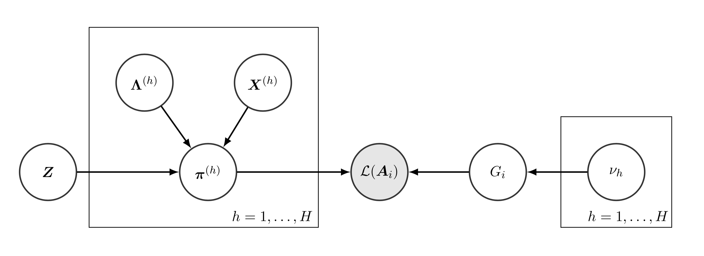

# Introduction

## Abstract

Diffusion tensor imaging, a means of using MR signal to approximately measure orientation and other properties of nerve fibers in the brain, can be used to map out structural connections between brain regions via white matter pathways. These pathways form networks, and thus ought to be amenable to the mathematical tools of network analysis. However, they have some unusually nice properties that many of these tools do not exploit. Vertices across all individuals can be identified with each other (whereas most network models don't make this assumption), and the presence or absence of edges is reasonably trustworthy (whereas most network models assume this is noisy, or that the observed graph is a subset of the true network). The problem instead becomes dealing with the case where we have many accurate samples from the same network-valued random variable, with a fixed set of vertices. We consider a particular Bayesian nonparametric model for approximating such random variables, presented by Durante, Dunson, and Vogelstein and further analyzed by Linderman and Blei. Results on simple simulations are mixed but the model is efficient and shows promise.


## The data

- Structural (not functional) connectivity
- White matter, derived from DTI/tractography
- Between macroscopic brain regions (Desikan atlas)
- Undirected, unweighted

## Diffusion tensor imaging (DTI)

- Measure direction of water flow using MRI
- Water flows parallel to nerve fibers, so DTI tells us a lot about their structure
- Places where flow is strongly obstructed in all but one direction are likely bundles of axons (anisotropic)

## Tractography

- Follow paths of high anisotropy to trace out locations of nerve fibers
- Images are very deceptive; they are very pretty but not "real"
- Where fibers cross, it tends to break down (absent more complex models)
- C. Thomas et al., “Anatomical accuracy of brain connections derived from diffusion MRI tractography is inherently limited,” Proc Natl Acad Sci U S A, vol. 111, no. 46, pp. 16574–16579, Nov. 2014.

## Perhaps it's okay, though

- Here, brain voxels were segmented into 68 known anatomical regions (Desikan atlas)
- With large regions like this known to correspond to anatomical reality, tractography is less problematic

## The dataset

- From the Open Connectome Project
- Healthy humans, DTI and tractography performed, segmented according to Desikan atlas
- Undirected, unweighted graphs
  - Vertices are brain regions
  - An edge exists if there is a track with endpoints in a pair of regions

## Properties of the data

- Each observation is a complete network
- The measurements are reasonably trustworthy, for our purposes we assume there are not spurious or missing edges in a given observation (not modeling errors for the moment)
- The set of vertices is the same across all samples
- Want a random variable whose values are whole networks, and where the identity of the vertices matters

## Papers

- "Nonparametric Bayes Modeling of Populations of Networks"
  - by Daniele Durante, David B. Dunson, Joshua T. Vogelstein
- A discussion of "Nonparametric Bayes Modeling of Populations of Networks" by Durante, Dunson, and Vogelstein (2016)
  - by Scott W. Linderman and David Blei
  - https://github.com/blei-lab/factorial-network-models

## The model(s)

- Combines two ideas

### Latent space models

- Each vertex is assumed to be a vector in some latent space
- Can think of the latent space as "features" or a kernel
- Nearness in latent space determines edge probability
- There may be global feature weights

### Mixture models

- The whole distribution is a mixture of many such models; first pick a model then draw a graph
- "Which mixture" is a latent variable; we're likely interested in the posterior distribution of this given an observed graph.

# Statement of Model

## Model likelihood


\begin{align*}
 &p \left(A_n |
    Z, \{\{x_v^{(h)}\}_{v=1}^V,
  \lambda^{(h)}\}_{h=1}^H, h_n \right) 
  =\\ &\prod_{u=1}^V \prod_{v=1}^{u-1}
  \text{Bern} \left(A_{n,[u,v]} |
    \sigma(z_{u,v} + x_{u}^{(h_n)^\intercal} \Lambda^{(h_n)} x_v^{(h_n)}) \right)
\end{align*}


## Left-hand side:

$$
p \left(A_n | Z, \{\{x_v^{(h)}\}_{v=1}^V, \lambda^{(h)}\}_{h=1}^H, h_n \right) 
$$

- $A_n$: the $n$th network from the data
- $x_v^{(h)}$: the latent space parameters of vertex $v$ in mixture component $h$.
- $\lambda^{(h)}$: a scaling factor for mixture component $h$
- $Z$: a bias applied for each edge, independent of component
- $h_n$: the mixture component we suppose $A_n$ came from

## Right-hand side:

$$
\prod_{u=1}^V \prod_{v=1}^{u-1}
  \text{Bern} \left(A_{n,[u,v]} |
    \sigma(z_{u,v} + x_{u}^{(h_n)^\intercal} \Lambda^{(h_n)} x_v^{(h_n)}) \right).
$$
    
- $A_n$: the $n$th network
- $h_n$: the mixture component we suppose $A_n$ comes from
- $x_u, x_v$: latent space vectors (per component $h_n$)
- $z_{u,v}$: bias term for connection between vertices $u$ and $v$
- $\Lambda^{h(n)}$: just $\text{diag}(\lambda^{(h_n)})$ (same scaling factors as matrix)
- $\sigma$: just the logistic function (squashes between 0 and 1)

## Plate diagram



## Prior distribution -- mixtures

- A "multiplicative inverse gamma", parameters are $a_1$ and $a_2$
- Key fact is that it encourages sparsity (the vector $\lambda^{(h)}$ will have fewer components)
- They do it in this complicated way because it guarantees full support (all possible graphs have nonzero probability)
$$
\lambda_r^{(h)} = \prod_{m=1}^r \frac{1}{\nu_m^{(h)}}, \text{ where } \nu_1^{h} \thicksim \Gamma(a_1, 1),\: \nu_{\ge 2}^{(h)} \thicksim \Gamma(a_2, 1)
$$

## Bias towards sparsity ("nonparametrics")

- Traditionally the phrase "Bayesian nonparametrics" refers to models where the number of mixture components (or some other parameter) is unbounded and adapts to the data
- Here, there is a fixed upper bound, but set unnecessarily high, with the priors ensuring that most components won't be used
- David Blei, the king of nonparametrics, seems okay with this

## Prior distribution parameters

- Edge biases are Gaussian: $Z \thicksim \mathbf{N}_{V(V-1)/2}(\mu, \Sigma)$
- So are latent parameters: $X_{vr}^{h} \thicksim \mathbf{N}(0, 1)$

## Gibbs sampler

- Monte Carlo method
- If you want to see how they derived it, it's in the paper
- Key fact: in each iteration, cluster assignments are sampled first
  - only parameters relevant to the sampled clusters are updated
  - so as sparsity encourages most cluster probabilities to be driven to zero, computation time is not wasted on their parameters
- While the original implementation is not available, Blei and Linderman have theirs on Github.

```{r source,echo=FALSE,message=FALSE,warning=FALSE}
source("R/latentspace_sample.R")
```

# Testing

## Testing methodology

- Fit on DTI data
- Random changes to networks, and/or random graphs from known distributions
- Questions: how fast does convergence occur, and what can model detect?

## Brain data: convergence

```{r import,echo=FALSE}
adjmats <- import_data() %>% process_data
map(adjmats, as.matrix) %>% abind(along=3) %>% aperm(perm=c(3,1,2)) -> allAs
allAs <- allAs > 0
```

```{r first_constants,echo=FALSE}
missing_frac <- 0.25
n_itr <- 100
Ks <- seq(2L,21L,4L)
sigmasq_b <- 1.0
H <- 10L
arrDims <- dim(allAs)
N <- arrDims[1]
Vorig <- arrDims[2]
bad_indices <- c(1,36)
good_indices <- (1:Vorig)[!((1:Vorig) %in% bad_indices)]
allAs <- allAs[, good_indices, good_indices]
V <- Vorig - length(bad_indices)
masks <- replicate(N, lsm.utils$random_mask(V, missing_frac))
```

```{r run_mixture, cache=TRUE,warning=FALSE,echo=FALSE}
mixture_models_sh <- map(Ks, ~ lsm$MixtureOfLatentSpaceModelsWithShrinkage(V, .*H, H=H, sigmasq_b=sigmasq_b, sigmasq_prior_prms=dict(a1=2.5, a2=3.5), name=paste0("mixture_shrinkage", .)))

mixture_models_sh %>% walk(~ model_prep(., allAs, masks)) %>% walk(~ .$initialize)
mixture_model_sh_results <- pblapply(mixture_models_sh, function(x) {fit_model(x, n_iter=n_itr, progress_bar=FALSE)})
mixture_model_sh_df <- map(mixture_model_sh_results, ~ .$df) %>% bind_rows
```

```{r,echo=FALSE}
mixture_model_sh_df %>% ggplot(aes(x=iteration, y=log_likelihood,color=name)) + geom_line()
```

## Brain data: assignments

```{r, echo=FALSE}
plot_mixture_assignments <- function(mixture_model_results, N, n_itr) {
  assignments_table <- as_tibble(simplify2array(map(mixture_model_results$model, ~ .$hs)))
assignments_table <- assignments_table %>% setNames(map(1:n_itr, paste0))
assignments_table$graph <- 1:N
assignments_df <- gather(assignments_table, iter, cluster, -graph)
assignments_df$cluster <- as.factor(assignments_df$cluster)
assignments_df$iter <- map_int(assignments_df$iter,strtoi)
ggplot(assignments_df, aes(iter, graph, fill=cluster)) + geom_tile()
}
```

```{r plot_mixture_assignments,echo=FALSE}
plot_mixture_assignments(mixture_model_sh_results[[4]], N, n_itr)
```

## Brain data: assignments

- Fit with different numbers of components
- All about the same, all ended up converging on assigning all graphs to a single component
- This is good, these graphs are very similar to each other so the model is behaving appropriately.

```{r, echo=FALSE}
adjmats <- import_data() %>% process_data
map(adjmats, as.matrix) %>% abind(along=3) %>% aperm(perm=c(3,1,2)) -> allAs
allAs <- allAs > 0
graphdims <- dim(adjmats[[1]])
rand_mats <- array(rbernoulli(graphdims[1]*graphdims[2]*10), dim=c(10,graphdims[1],graphdims[2]))
allAs <- abind(allAs, rand_mats, along=1)
```

```{r random_constants, echo=FALSE}
missing_frac <- 0.25
n_itr <- 100
Ks <- seq(2L,21L,4L)
sigmasq_b <- 1.0
H <- 10L
arrDims <- dim(allAs)
N <- arrDims[1]
Vorig <- arrDims[2]
bad_indices <- c(1,36)
good_indices <- (1:Vorig)[!((1:Vorig) %in% bad_indices)]
allAs <- allAs[, good_indices, good_indices]
V <- Vorig - length(bad_indices)
masks <- replicate(N, lsm.utils$random_mask(V, missing_frac))
```

```{r run_random_model, cache=TRUE,warning=FALSE,echo=FALSE}
mixture_model_rand <-  lsm$MixtureOfLatentSpaceModelsWithShrinkage(V, 4L*H, H=H, sigmasq_b=sigmasq_b, sigmasq_prior_prms=dict(a1=2.5, a2=3.5), name="mixture_rand4")

model_prep(mixture_model_rand, allAs, masks)
mixture_model_rand$initialize()
mixture_model_rand_results <- fit_model(mixture_model_rand, n_iter=n_itr, progress_bar=FALSE)
mixture_model_rand_df <- mixture_model_rand_results$df
```


## Random graphs

- If we add some Bernoulli random graphs into the mix, they are correctly split into two clusters.

```{r, echo=FALSE}
plot_mixture_assignments(mixture_model_rand_results, N, n_itr)
```

## Random Changes to Graphs

- If we randomly perturb some edges to existing graphs, they are not correctly split into two clusters

```{r, echo=FALSE}
adjmats <- import_data() %>% process_data
map(adjmats, as.matrix) %>% abind(along=3) %>% aperm(perm=c(3,1,2)) -> allAs
allAs <- allAs > 0
graphdims <- dim(adjmats[[1]])
rand_mats <- abind(array(rbernoulli(graphdims[1]*graphdims[2]*21,0.75), dim=c(21,graphdims[1],graphdims[2])), array(TRUE,c(21,graphdims[1], graphdims[2])), along=1)
allAs <- allAs & rand_mats
```

```{r,echo=FALSE}
missing_frac <- 0.25
n_itr <- 100
Ks <- seq(2L,21L,4L)
sigmasq_b <- 1.0
H <- 10L
arrDims <- dim(allAs)
N <- arrDims[1]
Vorig <- arrDims[2]
bad_indices <- c(1,36)
good_indices <- (1:Vorig)[!((1:Vorig) %in% bad_indices)]
allAs <- allAs[, good_indices, good_indices]
V <- Vorig - length(bad_indices)
masks <- replicate(N, lsm.utils$random_mask(V, missing_frac))
```

```{r perturbed, cache=TRUE,warning=FALSE,echo=FALSE}
mixture_model_perturbed <- lsm$MixtureOfLatentSpaceModelsWithShrinkage(V, 4L*H, H=H, sigmasq_b=sigmasq_b, sigmasq_prior_prms=dict(a1=2.5, a2=3.5), name="mixture_perturbed")
model_prep(mixture_model_perturbed, allAs, masks)
mixture_model_perturbed$initialize()
mixture_model_p_results <- fit_model(mixture_model_perturbed, n_iter=n_itr, progress_bar=FALSE)
mixture_model_p_df <- mixture_model_p_results$df
```

```{r, echo=FALSE}
plot_mixture_assignments(mixture_model_p_results, N, n_itr)
```


## Specific Random Changes to Graphs

- If we limit this random perturbation to edges within a small number of vertices, no difference is detected

```{r, echo=FALSE}
adjmats <- import_data() %>% process_data
map(adjmats, as.matrix) %>% abind(along=3) %>% aperm(perm=c(3,1,2)) -> allAs
allAs <- allAs > 0
graphdims <- dim(adjmats[[1]])
maskArray <- array(TRUE, c(21, graphdims[1], graphdims[2]))
maskArray[1:21, 5:10,5:10] <- FALSE
rand_mats <- abind(maskArray | array(rbernoulli(graphdims[1]*graphdims[2]*21,0.75), dim=c(21,graphdims[1],graphdims[2])), array(TRUE,c(21,graphdims[1], graphdims[2])), along=1)
allAs <- allAs & rand_mats
```

```{r,echo=FALSE}
missing_frac <- 0.25
n_itr <- 100
Ks <- seq(2L,21L,4L)
sigmasq_b <- 1.0
H <- 10L
arrDims <- dim(allAs)
N <- arrDims[1]
Vorig <- arrDims[2]
bad_indices <- c(1,36)
good_indices <- (1:Vorig)[!((1:Vorig) %in% bad_indices)]
allAs <- allAs[, good_indices, good_indices]
V <- Vorig - length(bad_indices)
masks <- replicate(N, lsm.utils$random_mask(V, missing_frac))
```

```{r p2, cache=TRUE,warning=FALSE,echo=FALSE}
mixture_model_p2 <- lsm$MixtureOfLatentSpaceModelsWithShrinkage(V, 4L*H, H=H, sigmasq_b=sigmasq_b, sigmasq_prior_prms=dict(a1=2.5, a2=3.5), name="mixture_perturbed")
model_prep(mixture_model_p2, allAs, masks)
mixture_model_p2$initialize()
mixture_model_p2_results <- fit_model(mixture_model_p2, n_iter=n_itr, progress_bar=FALSE)
mixture_model_p2_df <- mixture_model_p2_results$df
```

```{r, echo=FALSE}
plot_mixture_assignments(mixture_model_p2_results, N, n_itr)
```

# Conclusions

## Is the model viable?

- Not very good results on these simple simulations
- It's worth exploring further, and does seem pretty powerful
- Good results in papers
- David Blei approves of it
- I would like to test it on real data with psychological or other covariates, if I had access (replicate result in a paper)

## Future work

- Extension for hypothesis testing -- Dunson and Durante have done this
- What kind of structural changes can it distinguish?
- Posterior predictive checks on network statistics (this one hopefully goes in the final report, it's just computationally intensive)
- Extension to weighted graphs
  - in the naive case, replacing the Bernoulli with a Gaussian should actully make things easier, but that may not be the right model